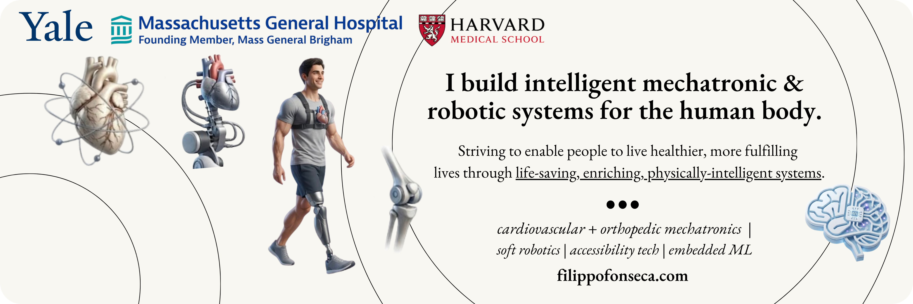

<div align="center">



<br/>
<br/>
<br/>

> *I strive to understand the human condition*
> *through engineering and beyond.*

<br/>

[](https://filippofonseca.com)
[%20%2B%20EECS%20'28-1a1a1a?style=flat-square&labelColor=f5f1e8)](https://yale.edu)
[](#-now)
[](mailto:filippo.fonseca@yale.edu)
[](https://twitter.com/FilippoFonseca)

</div>

---

## Abstract

I'm a **mechatronics engineer and roboticist** with a software + ML background. My focus is building **physically-intelligent biomechatronic systems** through robotics and materials innovations, mainly for **cardiac health / internal medicine** and **orthopaedics / biomechanics**.

I believe in treating **structure, geometry, and topology as first-class objects** to be uncovered, not averaged away by black-box models. This philosophy drives how I approach ML and computation in scientific, robotic, and biomedical settings.

🇮🇹 🇪🇸 🇨🇷 · Yale '28 · building humanist tech through engineering & research.

---

## ❦  Now

| | | |
|---|---|---|
| 🦴 **Biomedical Eng. Intern**: Biomechanics & Biomaterials | Harris Orthopaedics Lab, MGH / Harvard Medical School | *now* |
| 🤖 **President & Co-Founder** | Yale Undergraduate Robotics | *now* |
| 🚀 **Co-Lead & Lead Mechatronics Engineer**: Mars Exploration Rover | Yale Undergraduate Robotics | *now* |
| ❤️ **Lead Research Engineer**: Dynamic Electromechanical Bioreactor | Yale Integrative Cardiac Biomechanics Lab (Campbell Lab) | *now* |
| 🪱 **Research Assistant / Robotics Engineer**: burrowing & submersion robotics | The Faboratory at Yale (Kramer-Bottiglio Lab) | *now* |
| 🔬 **Mechanical Design Engineer**: precision microtome device | Johnson & Johnson Vision *(Yale MENG 4991)* | *now* |
| 📊 **Software Engineer & Data Scientist**: data-donation platform | Yale Sociology Department | *now* |

---

## ❦  Research Focus

#### 🦴 Orthopaedics, Biomechanics & Biomaterials
At the **Harris Orthopaedics Laboratory** (MGH / Harvard Med), developing the next generation of implant materials and devices to improve orthopedic-surgery outcomes, focused on reducing post-operative infection risk through mechanical devices that leverage **PK/PD optimization** for local antibiotic delivery in intra-articular (in-joint) conditions.

#### ❤️ Cardiac Health & Internal Medicine
Lead engineer for the **Dynamic Electromechanical Bioreactor (DEB)** at the Yale ICBL, combining mechatronics and biochemistry to simulate exercise-induced cardiac stress in human-engineered heart tissues, studying how **Arrhythmogenic / Desmoplakin Cardiomyopathy** progresses in endurance athletes. Programmable electromechanical loading, real-time force feedback, electrophysiology.

#### 🪱 Burrowing Robotics & Embodied AI
Soft, **variable-stiffness burrowing robots** at The Faboratory, treating granular-media mechanics, structure, and geometry as first-class design variables rather than averaging them away. Presented at IEEE RoboSoft and the Princeton Robotics Symposium; co-author on **Spatial-MemER**, an open-source spatial-reasoning extension to robot policies built with Stanford's IRIS Lab.

---

## ❦  Publications

- **[Common Ground: Standardizing Granular Media Characteristics for Burrowing Robots](https://ieeexplore.ieee.org/abstract/document/11522833)** · *2026 IEEE Int. Conference on Soft Robotics (RoboSoft)*, pp. 1005–1010. <br/> <sub>C. L. Le, **F. Fonseca Cagnazzo**, N. Ramos, E. I. Figueroa, C. Creager, R. Kramer-Bottiglio.</sub>
- **[Uncorrelated Track (UCT) Processing: Efficient Algorithmic Treatment and Benchmarking Best Practices for Space Domain Awareness](https://ui.adsabs.harvard.edu/abs/2025amos.conf...84F/abstract)** · *Advanced Maui Optical and Space Surveillance (AMOS) Technologies Conference*, 2025, p. 84. <br/> <sub>**F. Fonseca**, O. Pinhasi, Z. Zitzewitz.</sub>

---

## ❦  Building & Open Source

**[hyperpolymath.com](https://hyperpolymath.com)** · [`hyperpolymath-v2`](https://github.com/filippo-fonseca/hyperpolymath-v2): A personal life-OS for people who refuse to specialize. Areas, projects, tasks, habits, and calendar unified under a natural-language agent (**JARVIS**, on Claude Sonnet 4.6). Web + Tauri desktop + a custom ESP32 macropad. *Academic-paper-meets-Notion, MIT.*

**[degreeint.com](https://degreeint.com)**: *DegreeIntelligence.* Degree planning for Yale, used by **~1 in 6 Yale undergrads**. Scrapes scattered major requirements into one place: live distributional + major tracking, a drag-and-drop 4-year simulator, shared plans with friends, and an AI advisor (**CLEO**). Founder. Free forever. *([Yale Daily News →](https://yaledailynews.com/blog/2025/09/23/new-student-run-platform-aims-to-simplify-degree-planning/))*

**[Spatial-MemER](https://github.com/filippo-fonseca/spatial-memer)**: Open-source spatial extension to MemER for hierarchical VLA policies. Augments visual memory with an egocentric spatial map (camera pose via DPVO + forward kinematics, rendered bird's-eye-view keyframes) so the high-level policy can reason over *where*, not just *what*. Built with Mark Music (Stanford '28); ~a few lines on top of MemER, running at 1 Hz.

**[iSpy](https://github.com/filippo-fonseca/i-spy-hackathon)**: 🥈 *2nd place, Google × Yale SOM Hackathon.* A wearable AI vision system for the blind & visually-impaired. Clip a camera to your cap, ask *"Hey Hellen…"*, and get real-time scene description. Gemini vision + ElevenLabs voice + a FastAPI feed server + a React Native app. Builds a knowledge graph of what you've seen.

**[PosturePoke](https://github.com/filippo-fonseca/posture-poke)**: 🏅 *5th place (Hardware), YHack 2026.* A wearable that physically **pokes you when you slouch**. 6-DOF IMU tracks spine angle; an escalation ladder runs from a beep → library fart sounds → an AI voice coach → a servo-powered poker. Arduino + sensor fusion + a Next.js / Web Serial dashboard with no backend.

**[diush](https://github.com/diush-xyz/diush)**: Open-source mobile platform (1517 / Medici grantee): a link-sharing funnel that turns messy DM bidding into a clean, secure sale. React Native.

**[hyperpoly.me](https://github.com/filippo-fonseca/hyperpoly-me)**: A public, minimalist log of my daily language *training*, tracking reps across 7+ languages, treating each like a runner treats mileage.

---

## ❦  Selected History

- 🥈 **2nd place worldwide, World Robot Olympiad** (Senior Open, 🇨🇷): *UpDrop*, an autonomous drone-delivery system; historic finish for a Latin American nation, covered by 15+ outlets
- 🛰️ **SDA TAP Lab Team & Research Lead**: Uncorrelated Track (UCT) satellite-tracking algorithms with US Space Command (via YUAA)
- ⚗️ **Summer Research Fellow**: UCLouvain (IMMC/IMAP), multiscale reactor modeling for CO₂ methanation with green hydrogen
- 🧭 **Software Engineer**: CourseTable, Yale's most-used student site (millions of requests/semester); shipped the professor-insight page
- 🎙️ **Frontend Systems & Architecture Engineer**: Voqo AI (Sydney), B2B voice-AI platform
- 🤝 **Founder & Head of Engineering, HSC-GPT**: Australia's first localized AI education platform; *acquired by Art of Smart Education*
- 🌐 **Co-Founder & CEO, Zyndicate**: real-time collaboration platform, ~30k peak users, team of 12+ across 5 continents
- ▶️ **Creator**: YouTube: *Filippo Studies*

---

## ❦  Toolkit

```
languages   TypeScript · Python · C / C++ · Go · Rust · Dart · Swift · MATLAB
ml / sci    PyTorch · TensorFlow · NumPy · VLA / embodied AI · geometric learning
web         React · Next.js · Node · GraphQL · Tailwind · Supabase / Postgres
mobile      Flutter · React Native · Tauri
robotics    mechatronics · control · sensor fusion · embedded (ESP32 / Arduino)
hardware    CAD · KiCad · prototyping · precision mechanical design
```

---

<div align="center">

<br/>

**[filippofonseca.com](https://filippofonseca.com)**  ·  [email](mailto:filippo.fonseca@yale.edu)  ·  [x](https://twitter.com/FilippoFonseca)  ·  [instagram](https://www.instagram.com/filippo_fonseca)

<br/>

<sub>❦  *How you do one thing is how you do everything.*</sub>

</div>
